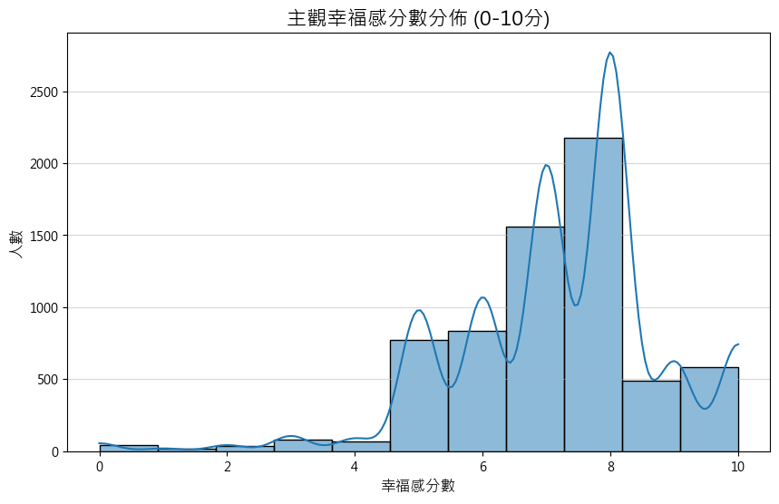
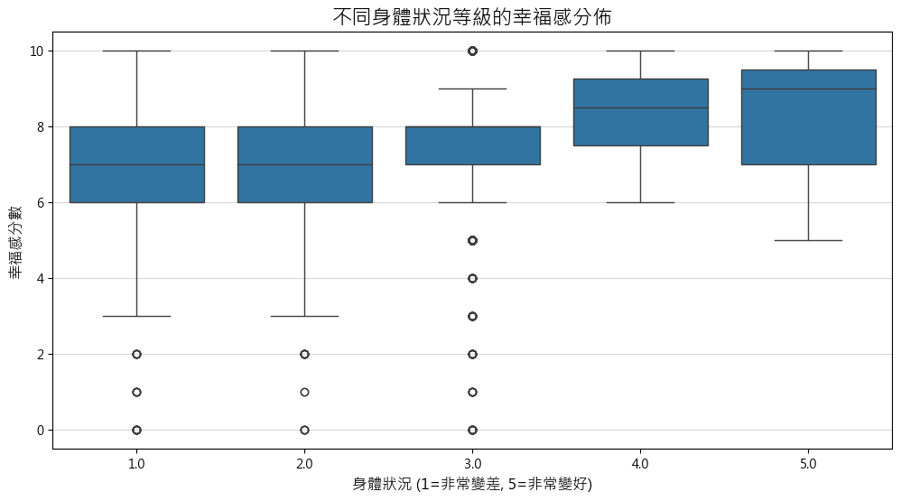
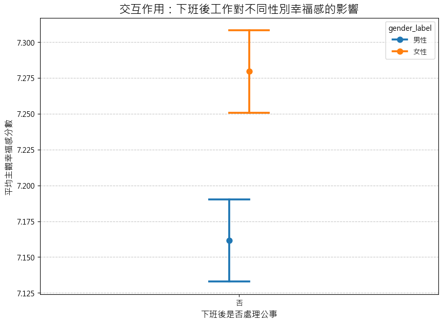

# 2025-Data-Science-Promenade

# 工作人口健康 × 主觀幸福感（資料分析）

以公開調查資料為基礎，探討工作人口的健康狀態與主觀幸福感之關聯，並產出多種視覺化圖表（包含不同年齡層的平均主觀幸福感）。

## 目錄結構

```
.
├─ data_preprocessing.ipynb        # 資料清理與前處理
├─ data_analysis.ipynb             # 資料分析
├─ data_analysis.
├─ working_population_health_data.csv
├─ 113年數位近用調查/               # 原始資料與說明文件
│  ├─ data113_1.csv
│  ├─ data113_2.csv
│  ├─ ques113_1.pdf / ques113_2.pdf
│  ├─ report113_1.pdf / report113_2.pdf
│  └─ 資料使用說明113.doc
├─ barplot_age_vs_happiness.png
├─ boxplot_happiness_vs_health.png
├─ happiness_distribution.png
└─ interaction_plot.png
```

## 環境需求

- Python 3.10+
- 主要套件：pandas、numpy、matplotlib、seaborn（統計檢定可加 scipy）

安裝（推薦使用虛擬環境）：

```bash
# venv（或改用 conda 亦可）
python -m venv .venv
. .venv/bin/activate  # Windows PowerShell: .venv\Scripts\Activate.ps1
pip install -U pip
pip install -r requirements.txt
```

## 快速再現

1) 先執行 `data_preprocessing.ipynb` 完成資料清理/彙整。  
2) 再執行 `data_analysis.ipynb` 產出圖表與統計摘要。  
3) 產出圖檔將位於專案根目錄。

## 分析重點（示例）

- 不同年齡層的平均主觀幸福感差異與趨勢。
- 健康自評與主觀幸福感的關聯（分布、箱型圖）。
- 可能的交互效果（例如年齡 × 健康對幸福感的影響）。

## 圖表預覽








## 資料來源與說明

- `113年數位近用調查/`：包含原始調查 CSV、問卷與報告 PDF、以及資料使用說明。實際變數定義請以資料夾內文件為準。
- `working_population_health_data.csv`：由前處理流程整理而成之分析用資料；若更新此檔，請同步更新 `data_preprocessing.ipynb`。

## GitHub 注意事項

- 檔名包含中文：建議以 UTF-8 編碼儲存（本庫使用 UTF-8）。
- 大型檔案（CSV/PDF/PNG）：若檔案超過 GitHub 建議大小，建議使用 Git LFS 追蹤（不影響一般使用）。
- 影像覆蓋：若重複輸出同名圖檔會被覆蓋，必要時請另存不同檔名（例如 `barplot_age_vs_happiness - 複製.png`）。

